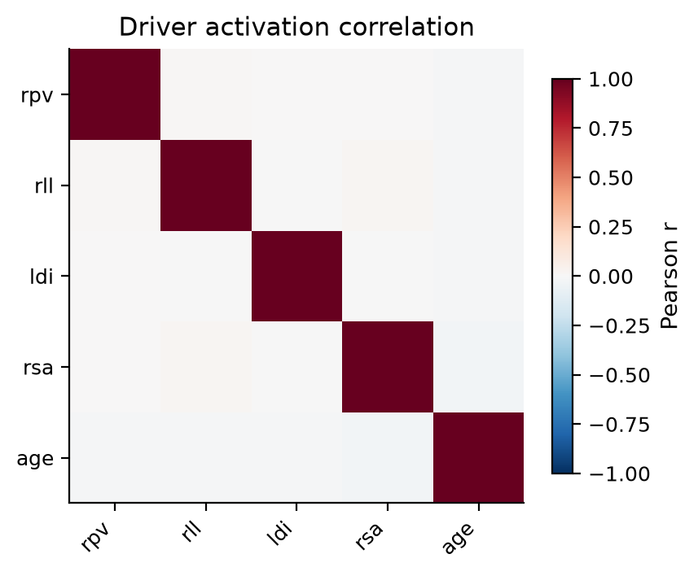
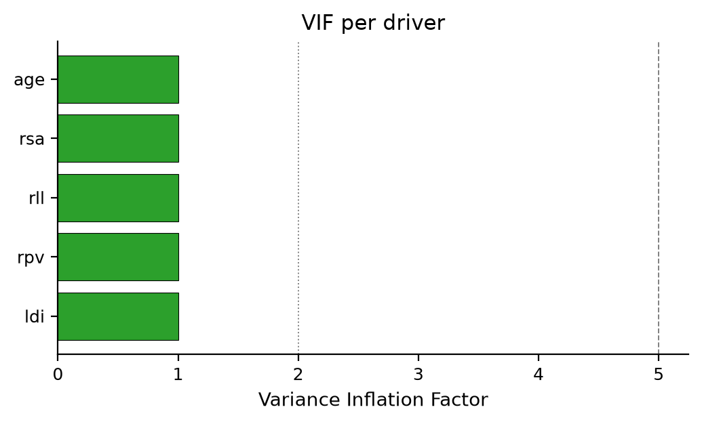
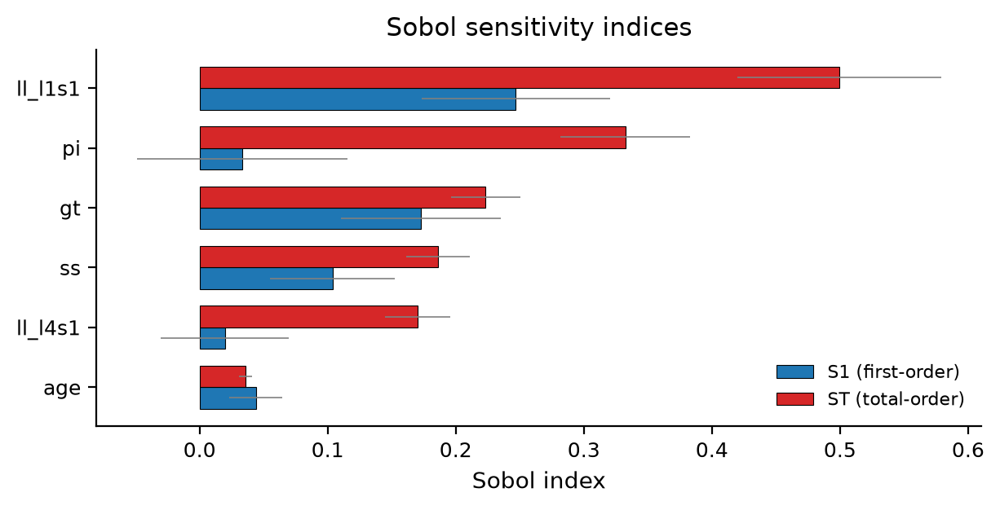
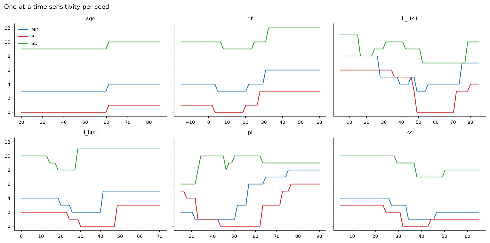
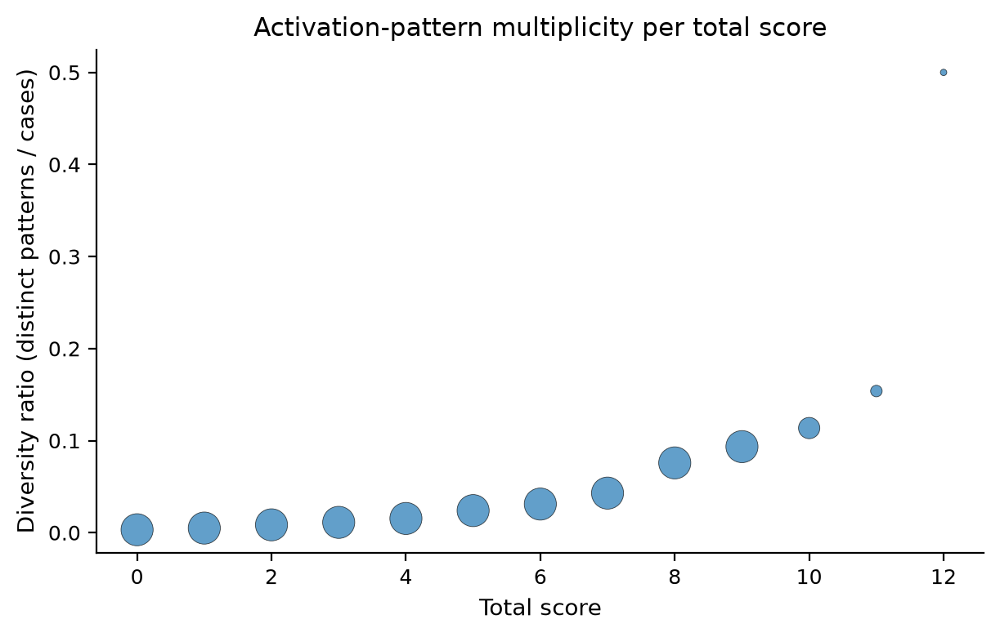

# GAP score (Yilgor 2017) — RuleAudit Report

**N synthetic cases:** 10,000
**Drivers analysed:** 5

## Headline diagnostics

- **Sensitivity**: INTERACTION-DOMINATED: 'pi' (S1=0.033, ST=0.332, interaction share 90.0%)
- **Sensitivity**: INTERACTION-DOMINATED: 'll_l1s1' (S1=0.247, ST=0.499, interaction share 50.6%)
- **Sensitivity**: INTERACTION-DOMINATED: 'll_l4s1' (S1=0.020, ST=0.170, interaction share 88.5%)
- **Pattern multiplicity**: LOW-PATTERN-RATIO: total=0.0 has 316.0 cases and 1.0 observed patterns (ratio=0.003)
- **Pattern multiplicity**: LOW-PATTERN-RATIO: total=1.0 has 802.0 cases and 4.0 observed patterns (ratio=0.005)
- **Pattern multiplicity**: LOW-PATTERN-RATIO: total=2.0 has 1059.0 cases and 9.0 observed patterns (ratio=0.008)
- **Pattern multiplicity**: LOW-PATTERN-RATIO: total=3.0 has 1610.0 cases and 18.0 observed patterns (ratio=0.011)
- **Pattern multiplicity**: LOW-PATTERN-RATIO: total=4.0 has 1817.0 cases and 28.0 observed patterns (ratio=0.015)
- **Pattern multiplicity**: HIGH-PATTERN-MULTIPLICITY: total=6.0 contains 40.0 observed activation patterns across 1287.0 cases
- **Pattern multiplicity**: HIGH-PATTERN-MULTIPLICITY: total=7.0 contains 37.0 observed activation patterns across 861.0 cases
- **Pattern multiplicity**: HIGH-PATTERN-MULTIPLICITY: total=8.0 contains 31.0 observed activation patterns across 409.0 cases
- **Pattern multiplicity**: HIGH-PATTERN-MULTIPLICITY: total=9.0 contains 20.0 observed activation patterns across 214.0 cases

## 1. Driver firing rates

|     |   fire_rate |   mean_contrib |
|:----|------------:|---------------:|
| rpv |       0.628 |           1.42 |
| age |       0.498 |           0.5  |
| rll |       0.443 |           1.12 |
| rsa |       0.439 |           0.46 |
| ldi |       0.394 |           0.78 |

## 2. Driver activation correlation

Maximum off-diagonal |r| = 0.024

## 3. Variance Inflation Factor

|     |   VIF |
|:----|------:|
| age | 1.001 |
| rsa | 1.001 |
| rll | 1.001 |
| rpv | 1     |
| ldi | 1     |

## 4. Sensitivity analysis

_Sobol and one-at-a-time analyses sample inputs independently and uniformly over the declared bounds (variance decomposition assumes input independence). When a correlated `joint_sampler` is used for the other tests, the sensitivity input distribution differs accordingly._

|         |    S1 |    ST |
|:--------|------:|------:|
| ll_l1s1 | 0.247 | 0.499 |
| pi      | 0.033 | 0.332 |
| gt      | 0.173 | 0.223 |
| ss      | 0.104 | 0.186 |
| ll_l4s1 | 0.02  | 0.17  |
| age     | 0.044 | 0.036 |

## 5. Activation-pattern multiplicity per total score

_Descriptive only: counts and ratios depend on the configured input distribution and sample size; they do not establish statistical identifiability, outcome heterogeneity, or clinical validity._

|   total |   n_cases |   n_patterns |   diversity_ratio |
|--------:|----------:|-------------:|------------------:|
|       0 |       316 |            1 |        0.00316456 |
|       1 |       802 |            4 |        0.00498753 |
|       2 |      1059 |            9 |        0.00849858 |
|       3 |      1610 |           18 |        0.0111801  |
|       4 |      1817 |           28 |        0.01541    |
|       5 |      1502 |           36 |        0.023968   |
|       6 |      1287 |           40 |        0.03108    |
|       7 |       861 |           37 |        0.0429733  |
|       8 |       409 |           31 |        0.0757946  |
|       9 |       214 |           20 |        0.0934579  |
|      10 |        88 |           10 |        0.113636   |
|      11 |        26 |            4 |        0.153846   |
|      12 |         8 |            4 |        0.5        |

