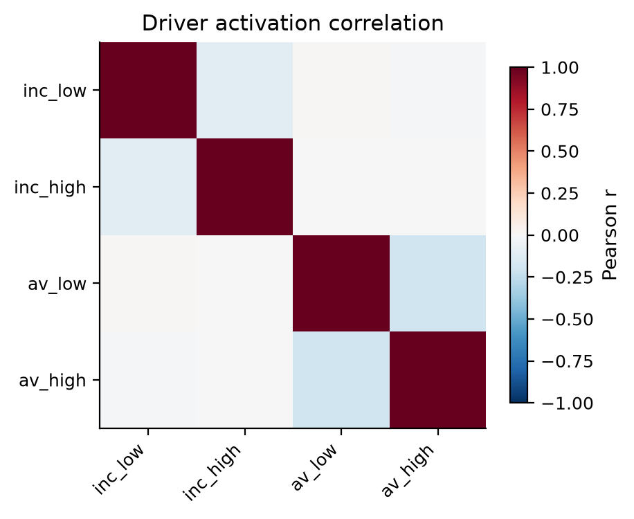
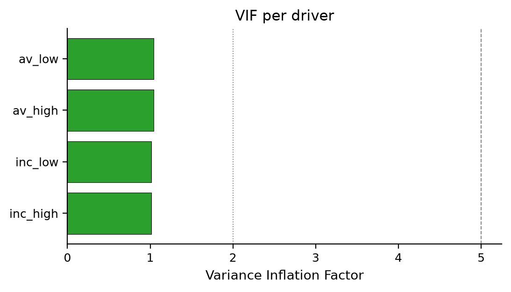
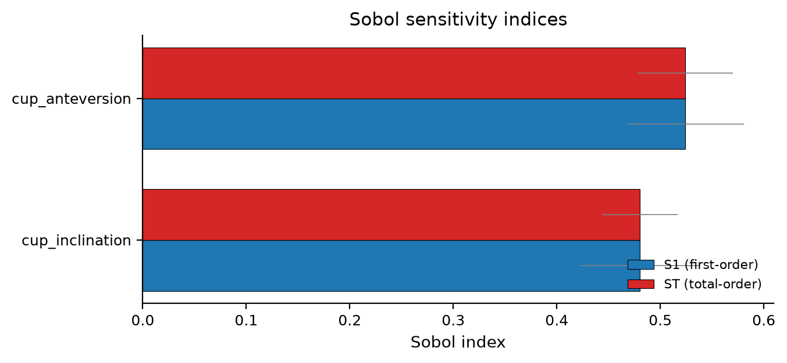
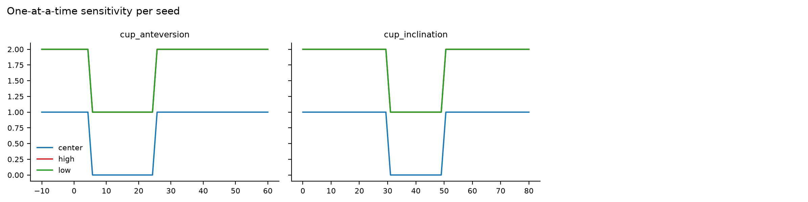
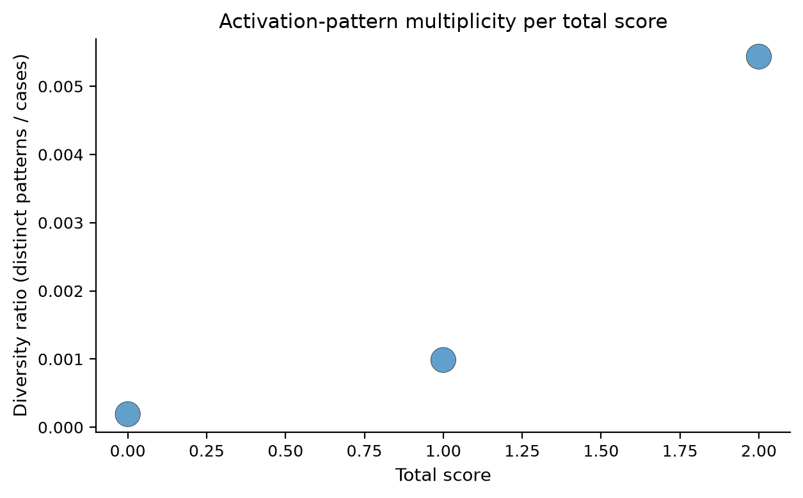

# Lewinnek safe zone (1978) — RuleAudit Report

**N synthetic cases:** 10,000
**Drivers analysed:** 4

## Headline diagnostics

- **Pattern multiplicity**: LOW-PATTERN-RATIO: total=0.0 has 5209.0 cases and 1.0 observed patterns (ratio=0.000)
- **Pattern multiplicity**: LOW-PATTERN-RATIO: total=1.0 has 4055.0 cases and 4.0 observed patterns (ratio=0.001)
- **Pattern multiplicity**: LOW-PATTERN-RATIO: total=2.0 has 736.0 cases and 4.0 observed patterns (ratio=0.005)

## 1. Driver firing rates

|          |   fire_rate |   mean_contrib |
|:---------|------------:|---------------:|
| av_high  |       0.168 |           0.17 |
| av_low   |       0.161 |           0.16 |
| inc_high |       0.158 |           0.16 |
| inc_low  |       0.066 |           0.07 |

## 2. Driver activation correlation

Maximum off-diagonal |r| = 0.197

## 3. Variance Inflation Factor

|          |   VIF |
|:---------|------:|
| av_low   | 1.04  |
| av_high  | 1.04  |
| inc_low  | 1.014 |
| inc_high | 1.013 |

## 4. Sensitivity analysis

_Sobol and one-at-a-time analyses sample inputs independently and uniformly over the declared bounds (variance decomposition assumes input independence). When a correlated `joint_sampler` is used for the other tests, the sensitivity input distribution differs accordingly._

|                 |    S1 |    ST |
|:----------------|------:|------:|
| cup_anteversion | 0.524 | 0.524 |
| cup_inclination | 0.48  | 0.48  |

## 5. Activation-pattern multiplicity per total score

_Descriptive only: counts and ratios depend on the configured input distribution and sample size; they do not establish statistical identifiability, outcome heterogeneity, or clinical validity._

|   total |   n_cases |   n_patterns |   diversity_ratio |
|--------:|----------:|-------------:|------------------:|
|       0 |      5209 |            1 |       0.000191975 |
|       1 |      4055 |            4 |       0.000986436 |
|       2 |       736 |            4 |       0.00543478  |

